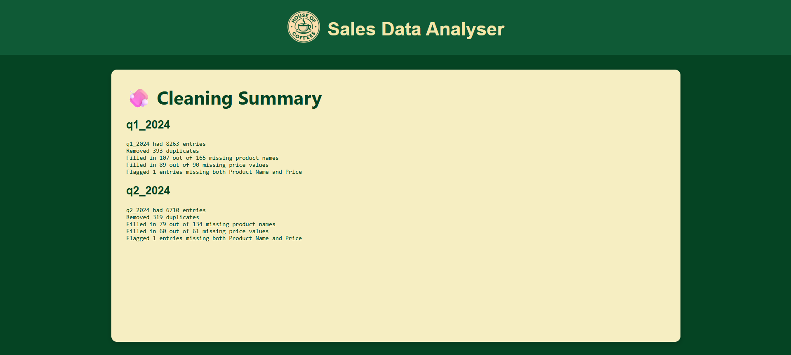
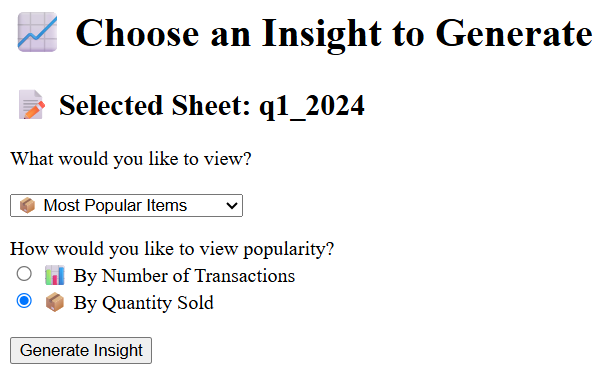
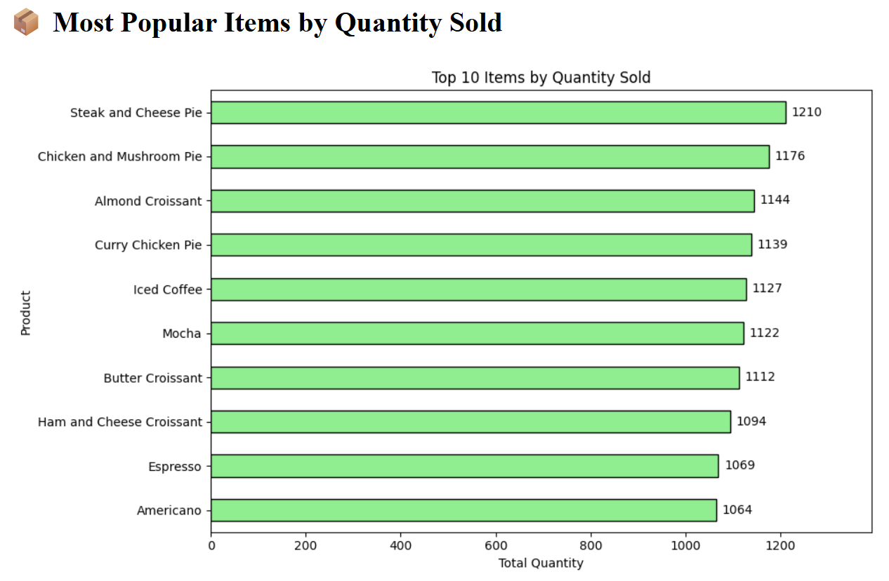

# ☕ Coffeehouse Sales Data Analyser

<b>This project is currently a work-in-progress.</b>

A web application built with React and Flask for a fictional coffeehouse to upload, clean, and analyse their sales data, which was generated with some errors.


## 🔍 Features

- 📤 Upload `.xlsx` Excel files with multiple transaction sheets, or select from existing uncleaned files.
  - Follows the coffeehouse's sheets format as in  `uncleaned-uploads`.

- 🧼 Cleans and processes each sheet:
  - Removes duplicate entries
  - Automatically fills in missing product names or prices where possible
  - Flags incomplete rows (missing both product name and price)
  - Saves cleaned sheets to database

- 📊 Analyses sheets to generate insights:
  - ⏰ Peak transaction times
  - 📦 Most popular items (by transaction count and by quantity sold)
  - 💰 Highest revenue-generating items

- ✨ Clean frontend for a smooth user experience.


## 📸 Screenshots (styled)


## 📸 Screenshots (unstyled)




## 🛠 Tech Stack

- **Frontend:** React.js
- **Backend:** Flask (Python 3)
- **Database:** PostgreSQL with SQLAlchemy
- **Libraries:** Pandas, Matplotlib


## 🗂 Folder Structure (NOT YET UPDATED)

```
coffeehouse-data-app/
│
├── backend/
│   └── routes
│       ├──__init__.py
│       ├──clean_routes.py
│       ├──cleaned_sheets_routes.py
│       ├──insights_routes.py
│   └── routes
│   ├── cleaner.py          # Excel sheet cleaning logic
│   ├── insights.py         # Insight generation and visualisation
│   ├── routes.py           # Flask routes
│   ├── utils.py            # Helper functions for filename generation
│   └── templates/          # HTML files (Jinja2)
│       └── ...
│
├── static/
│   └── charts/             # Chart images saved here
│
├── assets/                 # Only for storing README preview screenshots 
├── uploads/                # Uploaded Excel files
├── requirements.txt
└── README.md
```

---

## 🚀 How to Use

1. **Clone the repo**
   ```bash
   git clone https://github.com/WilliamTayNZ/coffeehouse-data-app.git
   cd coffeehouse-data-app
   ```

2. **Create and activate a virtual environment**
   ```bash
   py -m venv venv

   # For macOS/Linux
   source venv/bin/activate

   # For Windows
   venv\Scripts\activate
   ```

3. **Install dependencies**
   ```bash
   pip install -r requirements.txt
   ```

    ```bash
   cd frontend
   npm install
   ```

4. **Run the frontend and backend in separate terminals**
   ```bash
   py backend.py
   ```

   ```bash
   cd frontend
   npm run dev
   ```

5. **Enjoy!**

---
