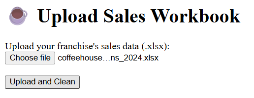
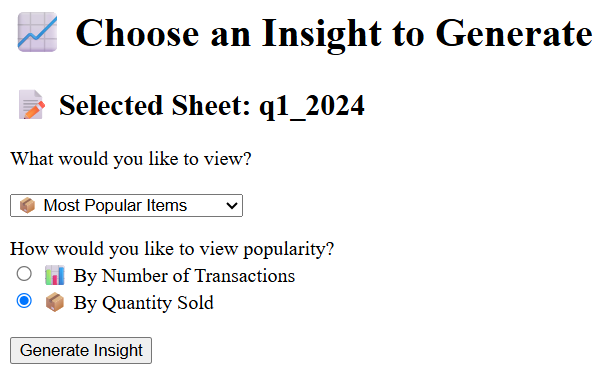

# ☕ Coffeehouse Sales Data Analyser

A Flask-based web application for a fictional coffeehouse to upload, clean, and analyse their sales data, which is generated as Excel sheets.

---

## 🔍 Features

- 📤 Upload `.xlsx` Excel files with multiple transaction sheets
  - Follows the coffeehouse's sheets format, see uploads folder

- 🧼 Cleans and processes each sheet:
  - Removes duplicates
  - Fills missing product names and prices based on menu
  - Flags incomplete rows
- 📊 Insights:
  - ⏰ Peak Transaction Times
  - 📦 Most Popular Items (by transaction count or quantity sold)
  - 💰 Highest Revenue Items
- 📁 Saves each chart as a uniquely named image for future access
- 💡 In-memory session management (will add a database in the future)

---

## 📸 Screenshots


---

---

---

---

## 🛠 Tech Stack

- **Backend:** Flask (Python 3)
- **Frontend:** HTML (Jinja2)
- **Libraries:** Pandas, Matplotlib
- **File Handling:** Secure file upload + chart image saving

---

## 🗂 Folder Structure

```
coffeehouse-data-app/
│
├── app/
│   ├── cleaner.py          # Excel sheet cleaning logic
│   ├── insights.py         # Insight generation and visualisation
│   ├── routes.py           # Flask routes
│   ├── utils.py            # Helper functions for filename generation
│   └── templates/          # HTML files (Jinja2)
│       └── ...
│
├── static/
│   └── charts/             # Chart images saved here
│
├── uploads/                # Uploaded Excel files
├── requirements.txt
└── README.md
```

---

## 🚀 How to Use

1. **Clone the repo**
   ```bash
   git clone https://github.com/your-username/coffeehouse-data-app.git
   cd coffeehouse-data-app
   ```

2. **Create and activate a virtual environment**
   ```bash
   python -m venv venv

   # For macOS/Linux
   source venv/bin/activate

   # For Windows
   venv\Scripts\activate
   ```

3. **Install dependencies**
   ```bash
   pip install -r requirements.txt
   ```

4. **Run the app**
   ```bash
   flask run
   ```

5. **Upload Excel data files**

- Download one of the coffeehouse's Excel data files from `uploads/`. 
- Then, upload this to the file directory, and click "Upload and Clean"!

---